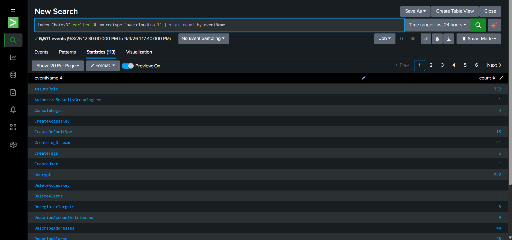
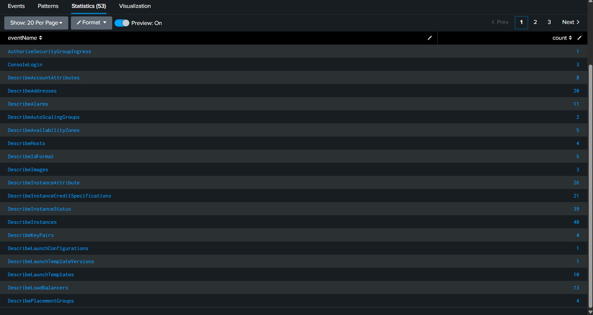
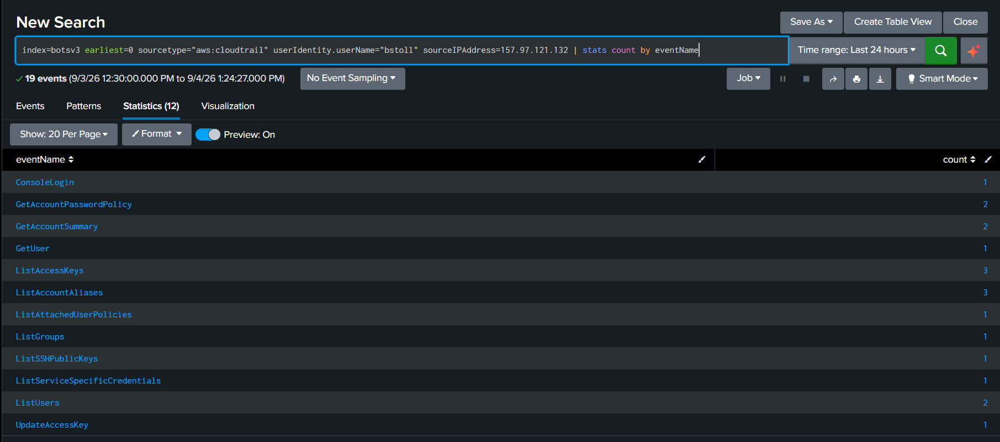
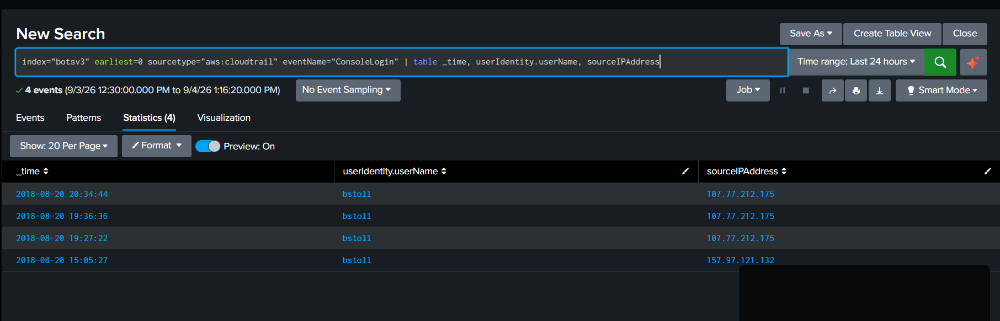
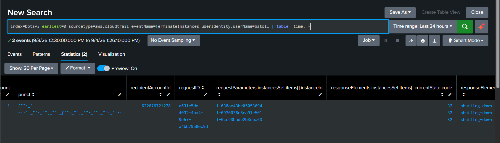
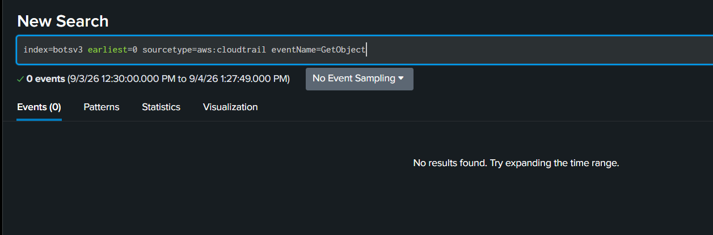

# SIEM Threat Detection & Incident Investigation — BOTS v3 (AWS Cloud Attack)

## Overview
This project involved investigating a simulated AWS cloud attack using **Splunk Enterprise** and the publicly available **Boss of the SOC (BOTS) v3 dataset**, published by Splunk. The goal was to identify unauthorized access, map attacker behavior to the **MITRE ATT&CK** framework, and document findings in the format of a real security incident report.

The dataset consists of pre-recorded AWS CloudTrail logs (and other AWS service logs) capturing a real-world-style attack scenario against a cloud environment.

---

## Tools Used
- **Splunk Enterprise** (Free tier) — log ingestion and SPL-based search/analysis
- **BOTS v3 dataset** (Splunk) — pre-indexed AWS attack simulation logs
- **MITRE ATT&CK Framework** — technique mapping for findings

---

## Investigation Summary

While reviewing `ConsoleLogin` events for the AWS account, four successful login events were identified for a single IAM user, **`bstoll`**, originating from two distinct geographic locations (New Jersey and California) within a short time window. No failed login attempts preceded these events, indicating the attacker used valid, likely compromised, credentials rather than brute-forcing access.

Behavioral analysis of API activity from each source clearly distinguished legitimate account usage from malicious activity:

| Source | Activity Pattern | Assessment |
|---|---|---|
| **New Jersey** | Low volume; self-service actions (`GetUser`, `ListAccessKeys`, `ListAttachedUserPolicies`, `GetAccountPasswordPolicy`) | Legitimate user activity |
| **California** | High volume automated enumeration (40+ `DescribeInstances`, 55 `GetBucketAcl`, 33 `DescribeVolumes`) plus destructive actions (`TerminateInstances`, security group modifications) | **Malicious — compromised credential use** |


*Initial exploration query showing the full range of AWS API activity logged in the dataset.*


*High-volume automated enumeration from the California source IP — 40+ DescribeInstances, 55 GetBucketAcl calls, plus destructive actions.*


*Low-volume, self-service activity from the New Jersey source IP — consistent with legitimate account usage.*

### Key Findings
1. **Valid Accounts abuse** — attacker logged in using `bstoll`'s legitimate credentials, with no prior failed attempts, suggesting credentials were compromised elsewhere (e.g. phishing, credential leak) rather than brute-forced.
   
   *Four ConsoleLogin events for user bstoll — first login from New Jersey, followed by three logins from California hours later.*

2. **Cloud infrastructure & storage discovery** — extensive `Describe*` and `GetBucketAcl`/`ListBuckets` calls indicate systematic reconnaissance of EC2 instances, volumes, security groups, and S3 buckets.
3. **Defense evasion attempt** — `AuthorizeSecurityGroupIngress` and `RevokeSecurityGroupIngress` calls suggest the attacker modified firewall rules, potentially to establish persistent access or cover tracks.
4. **Confirmed data destruction** — three EC2 instances were terminated by the attacker:
   - `i-038ae43bc05053694`
   - `i-0920036c8ca91e501`
   - `i-0cc93bade2b3cba63`

   
   *Confirmed EC2 instance termination — three instances destroyed by the compromised account.*

5. **No confirmed data exfiltration** — a search for `GetObject` events returned zero results across the entire dataset, indicating S3 buckets were probed for permissions/metadata but no object-level (file) access was logged.

   
   *No GetObject events found for any user in the dataset, confirming no object-level S3 access was logged during the incident.*

---

## Detection Queries Used

**1. Identify console login activity:**
```spl
index=botsv3 sourcetype=aws:cloudtrail eventName=ConsoleLogin
| table _time, userIdentity.userName, sourceIPAddress
```

**2. Compare activity by source IP (per suspected session):**
```spl
index=botsv3 sourcetype=aws:cloudtrail userIdentity.userName=bstoll sourceIPAddress="<IP>"
| stats count by eventName
```

**3. Identify destructive actions (instance termination):**
```spl
index=botsv3 sourcetype=aws:cloudtrail eventName=TerminateInstances userIdentity.userName=bstoll
| table _time, *
```

**4. Check for data exfiltration via S3 object access:**
```spl
index=botsv3 sourcetype=aws:cloudtrail eventName=GetObject
| stats count by userIdentity.userName
```

---

## MITRE ATT&CK Mapping

| Observed Behavior | Technique ID | Technique Name |
|---|---|---|
| Login using valid, likely compromised credentials | T1078 | Valid Accounts |
| Mass `Describe*` API calls across EC2/S3/networking | T1580 | Cloud Infrastructure Discovery |
| `GetBucketAcl`, `ListBuckets` probing | T1619 | Cloud Storage Object Discovery |
| Security group rule modification | T1562.007 | Impair Defenses: Disable Cloud Firewall |
| `TerminateInstances` on 3 EC2 instances | T1485 | Data Destruction |

---

## Impact Assessment
- **Confidentiality**: Low-to-moderate — buckets and permissions were enumerated, but no evidence of actual file access or exfiltration.
- **Integrity**: Moderate — security group rules were altered, indicating possible unauthorized network configuration changes.
- **Availability**: High — three production EC2 instances were terminated, representing direct, confirmed service disruption.

---

## Recommendations
1. **Rotate and revoke** the compromised credentials for `bstoll` immediately, and enforce MFA on all IAM users with console access.
2. **Enable AWS GuardDuty** (if not already active) for automated anomaly detection on future logins from new geographic locations.
3. **Restrict IAM permissions** using least-privilege principles — the compromised account should not have had permissions to terminate instances or modify security groups if that wasn't required for its role.
4. **Enable S3 object-level logging** (data events in CloudTrail) going forward, since object-level access (`GetObject`) was not logged in this environment — a detection gap that would hide real exfiltration if it occurred.
5. **Set up alerting** for logins to the same account from geographically distant locations within a short time window (impossible travel detection).

---

## Author
**Haritha G** — Cybersecurity Graduate.
